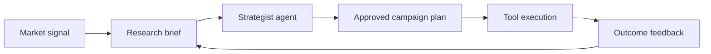

<div align="center">

# AI-GTM

**Turn market signals into approved GTM work your team can execute.**

A strategy workbench for research, planning, approval and execution, combining agent workflows with
operational tools instead of an ungrounded chatbot.

[](https://github.com/boss477/AI-GTM/actions/workflows/ci.yml)
[](LICENSE)


</div>

## Contents

1. [Strategy workflow](#strategy-workflow)
2. [Components](#components)
3. [Setup](#setup)
4. [Run](#run)
5. [Design principles](#design-principles)
6. [Third-party code](#third-party-code)
7. [Security](#security)
8. [Contributing](#contributing)
9. [License](#license)

## Strategy workflow


```mermaid
flowchart LR
  A[Market signal] --> B[Research brief] --> C[Strategist agent]
  C --> D[Approved campaign plan] --> E[Tool execution] --> F[Outcome feedback]
  F --> B
```

## Components

| Path                | What it is                                                                 |
| ------------------- | -------------------------------------------------------------------------- |
| `strategist_agent/` | Strategy workflows and tools                                               |
| `hunter_agent/`     | Lead-hunting Flask app (Exa search, Supabase storage)                      |
| `furniture-agent/`  | Furniture lead agent: Streamlit UI, Telegram bot, lead scoring             |
| `invoice_system/`   | Invoice and proforma automation (Flask, PDF generation, scheduled e-mail)  |
| `dashboard/`        | Combined dashboard over the hunter and invoice agents                      |
| `unified_agent.py`  | One agent (ARIA) that combines the strategist, hunter and invoice skills   |
| `telegram_app.py`   | Telegram front end for the unified agent                                   |
| `plans/`, `docs/`   | Design plans and specs                                                     |

## Setup

Requires Python 3.10 or newer.

```bash
git clone https://github.com/boss477/AI-GTM.git
cd AI-GTM
python -m venv .venv
.venv/Scripts/activate        # Windows; on macOS/Linux: source .venv/bin/activate
pip install -r hunter_agent/requirements.txt -r invoice_system/requirements.txt -r furniture-agent/requirements.txt
cp .env.example .env          # then fill in your own keys
```

All credentials come from the environment. `.env.example` lists every variable; `.env` is
git-ignored.

## Run

```bash
python dashboard/app.py          # dashboard on http://127.0.0.1:5000
python hunter_agent/app.py       # lead hunter (Flask)
python invoice_system/app.py     # invoice system (Flask)
streamlit run furniture-agent/app.py
python telegram_app.py           # Telegram bot for the unified agent
```

The Flask debugger is off by default. Set `FLASK_DEBUG=1` locally if you need it, and never on a
reachable host.

## Design principles

- Agent reasoning is visible and reviewable.
- Approval gates are explicit before external actions.
- Tool boundaries and credentials are documented.
- Research stays connected to an executable next step.

See [DESIGN.md](DESIGN.md) for the product design.

## Third-party code

The repository includes copies of upstream projects, each under its own license:

- `agno/`: [Agno](https://github.com/agno-agi/agno), Apache License 2.0 (see `agno/LICENSE`)
- `langgraph/`: [LangGraph](https://github.com/langchain-ai/langgraph), MIT License
- `agno-llms-full.txt`: Agno documentation text

These are not covered by this repository's license and are excluded from CI checks.

## Security

Never commit credentials. See [SECURITY.md](SECURITY.md) for how secrets are handled and how to
report a vulnerability.

## Contributing

Read [CONTRIBUTING.md](CONTRIBUTING.md) and the [Code of Conduct](CODE_OF_CONDUCT.md) first.

## License

[MIT](LICENSE) © boss477, except the third-party directories listed above.
